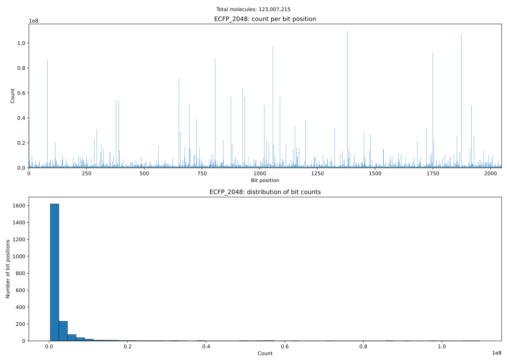

# Molecular Fingerprint Bucket Counts

[](https://github.com/LucaCappelletti94/molecular-fingerprint-bucket-counts/actions/workflows/ci.yml)


Are molecular fingerprint buckets uniform? This pipeline downloads all ~116M InChI entries from PubChem, normalizes molecules with RDKit, computes multiple fingerprints via scikit-fingerprints, and counts how many molecules activate each bit position. The output is per-fingerprint CSVs, histograms showing the distribution across buckets, and bit co-occurrence matrices.

## Example output

Below is the histogram produced for **ECFP at 2048 bits** over the full PubChem dataset:



The figure contains two subplots:

- **Top — count per bit position.** Each bar corresponds to one of the 2048 bit positions in the fingerprint. The height of a bar is the number of molecules (out of all molecules processed) that have that bit set to 1. If the fingerprint hashes features into buckets uniformly, all bars should be roughly the same height. Bars that are much taller than average indicate "hot" bits where many unrelated features collide; bars near zero indicate wasted capacity.
- **Bottom — distribution of bit counts.** This is a histogram of the per-bit counts from the top plot. It answers: across all 2048 bit positions, how are the hit-counts distributed? A tight, narrow peak means most bits are activated by a similar number of molecules (good uniformity). A wide or multi-modal distribution signals that some bits are hit far more often than others (hash collision imbalance).

The supertitle shows the total number of molecules that were successfully fingerprinted.

## Setup

```bash
uv sync
```

## Usage

```bash
# Full run (downloads ~6.8 GB from PubChem, processes all ~116M molecules)
uv run fp-bucket-counts

# Quick test with 1000 molecules
uv run fp-bucket-counts --limit 1000
```

Each run prints a dedicated `ntfy.sh` topic URL and sends progress notifications for the main pipeline milestones.

Results (CSVs and SVGs) are written to `output/`.

## Tests

```bash
uv run pytest tests/ -v
```
